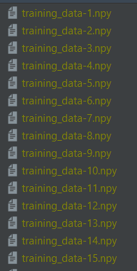
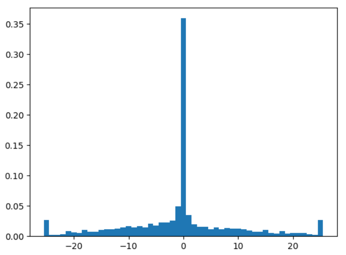
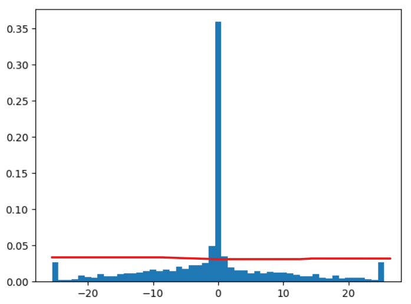

# UIT-Car-AI

# Hướng dẫn sử dụng:

## 0. Cài đặt source code:

- Cài pycharm
- Clone source này về
- Mở folder bằng pycharm -> tools -> Sync Python requirement -> ok -> Đợi cài xong các library

## 1. Lấy dữ liệu training:

- Tạo folder data
- Chạy map, chuyển sang chế độ autopilot
- Chạy file `get_trainning_data.py`, dữ liệu sẽ được lưu vào folder data, tự động đánh số từ 1. 
- Bấm A hoặc D để quẹo trái phải, hiện tại tốc độ sẽ cố định (tìm cách tối ưu sau)
- Bấm Q để dừng thu thập dữ liệu

Ví dụ sau khi hoàn thành thu thập dữ liệu:



## 2. Cân bằng data và đưa về 1 file:

Xét dữ liệu thu thập được sau 10000 hình ảnh:



Ta thấy, góc lái = 0 có tỉ lệ xuất hiện cao nhất -> nếu đưa dữ liệu này vào thì model sẽ có xu hướng đi thẳng nhiều hơn -> overtraining

Giải pháp: cắt data tại điểm mà ta thấy tương đối cân bằng nghĩa là các giá trị góc lái có tỉ lệ xuất hiện gần bằng nhau.

Ví dụ: cắt tại đây:



**Chạy file `balancing_data.py` để thực hiện cân bằng data.**

Thay đổi các biến trong code để có dữ liệu phù hợp

## 3. Trainning model:

- Chạy file  `tranning_model.py` để bắt đầu trainning. Lựa chọn các model trong file `model.py` 

- Mở terminal, chạy lệnh 

    ```buildoutcfg
    tensorboard --logdir log
    ```

    Sau đó mở trình duyệt ở url http://localhost:6006/ để xem quá trình trainning.

## 4. Test model:

- Chạy map, chuyển sang chế độ autopilot
- Chạy file `test_model.py` để test model.

## 5. Helper:

- Xem dữ data thu thập được, chạy file `test_data.py`, thay đổi đường dẫn trong file thành data muốn xem.

